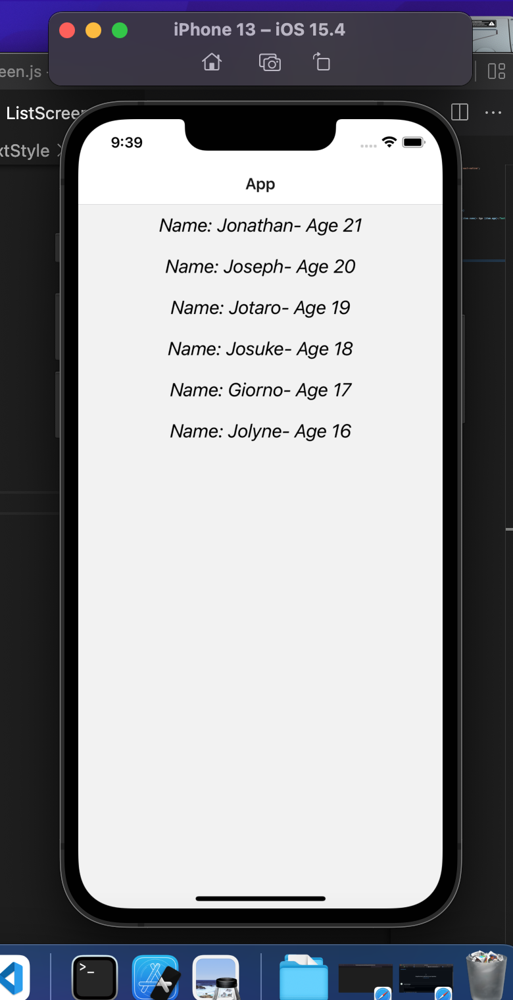

<!-- PROJECT LOGO -->
 

<h3 align="center">Christmin's Learning Journal</h3>

  

 12 April 2022

<!-- ABOUT THE PROJECT -->
## Day Seven

Today is day 2 of learning React Native on Udemy covering flatlist, key extractor and some flatlist props. Completed the exercise provided by the Udemy course for today as well.

## Learning Points
<ol>
  <li>React Native Flat List</li>
  - allows us to turn array into list of elements
  <li>Key Extractor and its implementation</li>
  - Used to extract a unique key for a given item at the specified index. Key is used for caching and as the react key to track item re-ordering. 
   <li>Flatlist prop</li>
  - Eg. horizontal prop to scroll horizontally across the screen
</ol>
 

<!-- challenges -->
## Challenges Faced
<ol>
  <li>Nil :)</li>
</ol>

<!-- CONTACT -->
## Resources
* <a href="https://docs.google.com/document/d/1z9KJrfoGPsejG670rZVt088W6VCt1FyQbjMSf9n86aA/">Day 7: React Native Flatlist component</a>
* <a href="https://docs.google.com/document/d/1X1WgRPKxWwenKXswD5xHcuEZ4NFRj8EWmkCC8MLsBwg/">React Native Learning Schedule</a>

<!-- ACKNOWLEDGMENTS -->
## Acknowledgments

* Thank you to the Team at Activate Interactive
* <a href="https://github.com/othneildrew/Best-README-Template">Othneil Drew</a> for this Template

(<a href="#top">back to top</a>)

