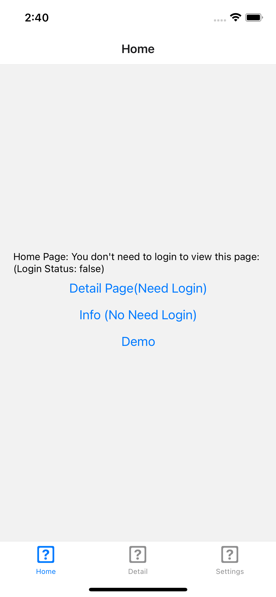
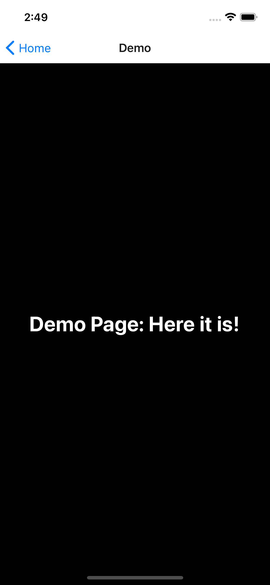
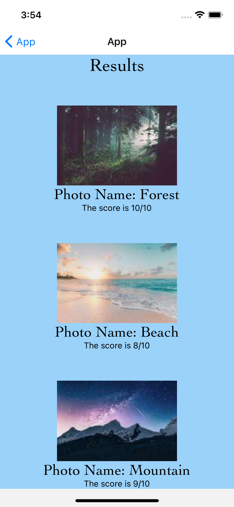

<!-- PROJECT LOGO -->
 

<h3 align="center">Christmin's Learning Journal</h3>

  

 13 April 2022

<!-- ABOUT THE PROJECT -->

## Day Eight

It is day 3 of learning React Native on Udemy. Today's learning topics includes Buttons, Touchable opacity and navigation. I tried creating a component by following the udemy instructor as well.

## Learning Points

<ol>
  <li>React Native Button</li>
  - simple component for displaying a button and detecting a press. It comes with its own styling and only the color can be modified. It does not accept the style prop, so if we require more customisation we should use the Touchable opacity instead.
  <li>Touchable Opacity</li>
  - highly customisable component that can detect a press on any kinds of element including images. There is no pre styling included.
   <li>React Native Navigation</li>
   - onPress={() => navigation.navigate('Example')
  <li>React Native Components</li>
  </ol>
 
 ## Add demo navigation to home page
 
<ol>
  <li>Create demo folder under screens with a index.tsx inside.</li>
  <li>Export default Demo & import DemoScreen from "../screens/dashboard/demo" in AppStack.tsx</li>
    <li>In AppStack.tsx create StackScreen for Demo < Stack.Screen
          name={NavigationNames.Demo}
          component={DemoScreen}
          options={{
            title: "Demo"
          }}
        />)</li>
    <li>include the following in navigation-names.ts //Demo = "Demo"</li>
  <li>include the following in Home/index.tsx //< Button title="Demo" onPress={() = >navigate(NavigationNames.Demo)}</li>
 />
</ol>

<!-- challenges -->

## Creating a component

<ol>
  <li>Create a separate folder in source and create the component file inside.</li>
  <li>Export default components & Import components into the screen you want to display them.</li>
    <li>Define your own propname (eg. title, subtitle)</li>
    <li>In component file:
const SampleComponent = (props) => {
  return (
    < View>
      <Text>Photo Name: {props.title}</Text>
      <Text>The score is {props.subtitle}</Text>
    </ View>
  );
};
</li>
  <li>Fill in the details for the propname in screen file.</li>
</ol>

<!-- CONTACT -->

## Resources

- <a href="https://docs.google.com/document/d/1Ae2L7WqB_7fwU7dcnm8JtFNdTtyrRr8flq5aGFCDsUU/">Day 8: React Native Navigation</a>
- <a href="https://docs.google.com/document/d/1X1WgRPKxWwenKXswD5xHcuEZ4NFRj8EWmkCC8MLsBwg/">React Native Learning Schedule</a>

<!-- ACKNOWLEDGMENTS -->

## Acknowledgments

- Thank you to the Team at Activate Interactive
- <a href="https://github.com/othneildrew/Best-README-Template">Othneil Drew</a> for this Template

(<a href="#top">back to top</a>)

