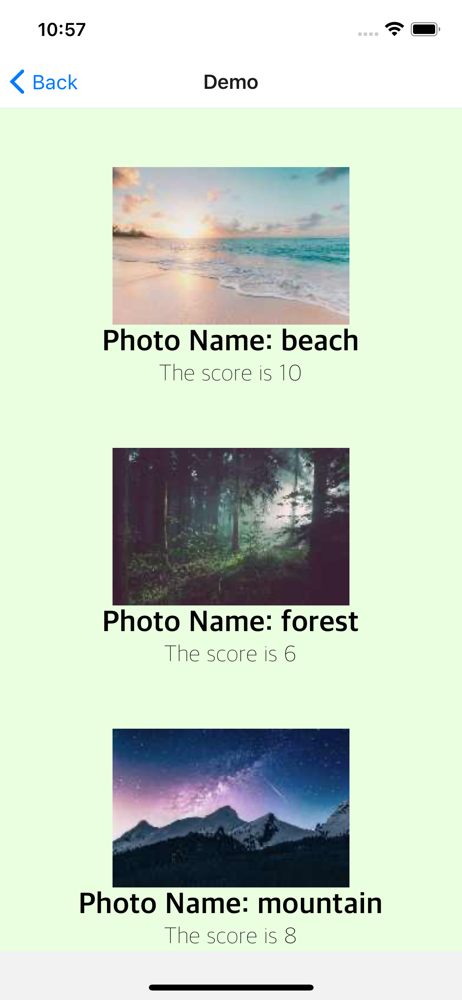

<!-- PROJECT LOGO -->
 

<h3 align="center">Christmin's Learning Journal</h3>

  

 14 April 2022

<!-- ABOUT THE PROJECT -->

## Day Nine

It is day 9 of learning React Native on Udemy. Today's learning topic is about creating reusable components.

## Learning Points

<ol>
  <li>React Native Component</li>
  
  - Components let us split the UI into independent, reusable pieces, and think about each piece in isolation.
  
  - They are like javascript functions as they accept props and return React elements describing what should appear on the screen
  
  - User-Defined Components Must Be Capitalized as React treats components starting with lowercase letters as DOM tags. For example, < div /> represents an HTML div tag, but < Welcome /> represents a component and requires Welcome to be in scope.
  
  <li>Converting Component from Javascript to Typescript</li>
  
  - Need to declare as an Interface first.
  
  - Will need to import ImageRequireSource as well (Why react-starter's js file don't need? check with mentors on Monday)
  
  - The other steps are the same as what I did yesterday.
  
  </ol>

## Add component in React Native Starter

 

<!-- CONTACT -->

## Resources

- <a href="https://docs.google.com/document/d/192rnWp4581_NDErzvnU-9kithr9-D-6_YbJr0jmPdOs/edit#heading=h.sjc7nb6il2di">Day 9: React Native Component</a>
- <a href="https://docs.google.com/document/d/1X1WgRPKxWwenKXswD5xHcuEZ4NFRj8EWmkCC8MLsBwg/">React Native Learning Schedule</a>

<!-- ACKNOWLEDGMENTS -->

## Acknowledgments

- Thank you to the Team at Activate Interactive
- <a href="https://github.com/othneildrew/Best-README-Template">Othneil Drew</a> for this Template

(<a href="#top">back to top</a>)

