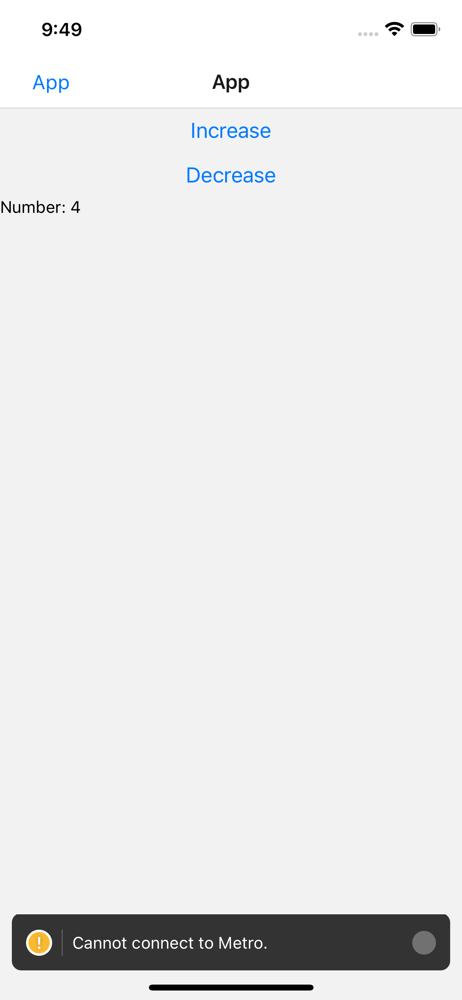

<!-- PROJECT LOGO -->
 

<h3 align="center">Christmin's Learning Journal</h3>

  

 14 April 2022

<!-- ABOUT THE PROJECT -->

## Day Nine

It is day 5 of learning React Native on Udemy. Today's learning topic is about state in react native.

## Learning Points

<ol>
  <li>React Native State</li>
  
  - There are two types of data that control a component: props and state. Props are system to pass data from parent to child. State is a system to track a piece of data that changes over time.

- We should initialize state in the constructor, and then call setState when you want to change it. We cannot change the state itself directly.

- Three Questions to ask when creating state.

1.  What piece of data is changing in the app?
2.  The type of data
3.  The data's start value.

   <li>React Native Hooks</li>

- A Hook is a special function that lets you “hook into” React features. For example, useState is a Hook that lets you add React state to function components.

- If you write a function component and realize you need to add some state to it, previously you had to convert it to a class. Now you can use a Hook inside the existing function component.

   </ol>

 

<!-- CONTACT -->

## Resources

- <a href="https://docs.google.com/document/d/192rnWp4581_NDErzvnU-9kithr9-D-6_YbJr0jmPdOs/edit#heading=h.sjc7nb6il2di">Day 9: React Native Component</a>
- <a href="https://docs.google.com/document/d/1X1WgRPKxWwenKXswD5xHcuEZ4NFRj8EWmkCC8MLsBwg/">React Native Learning Schedule</a>

<!-- ACKNOWLEDGMENTS -->

## Acknowledgments

- Thank you to the Team at Activate Interactive
- <a href="https://github.com/othneildrew/Best-README-Template">Othneil Drew</a> for this Template

(<a href="#top">back to top</a>)

