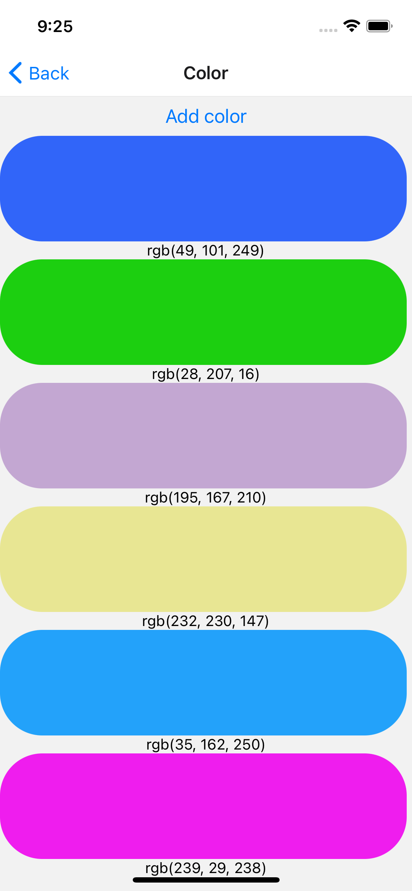

<!-- PROJECT LOGO -->
 

<h3 align="center">Christmin's Learning Journal</h3>

  

 19 April 2022

<!-- ABOUT THE PROJECT -->

## Day Nine

It is day 6 of learning React Native on Udemy. Today's learning topic is continuing yesterday's topic on UseState

## Learning Points

<ol>
  <li>React Native State</li>

- In today's exercise we will be making a random color generator
  function FavoriteColor() {
  const [color, setColor] = useState("");
  }
- The first value, color, is our current state.

- The second value, setColor, is the function that is used to update our state.

- The useState Hook can be used to keep track of strings, numbers, booleans, arrays and objects

- When state is updated, the entire state gets overwritten.

   </ol>

 

<!-- CONTACT -->

## Resources

- <a href="https://docs.google.com/document/d/1cRvpoFv6bLiW_IqifuowDRvnL07YTNZ_O9bdT-GoYOg/">Day 11: React Native State Management</a>
- <a href="https://docs.google.com/document/d/1X1WgRPKxWwenKXswD5xHcuEZ4NFRj8EWmkCC8MLsBwg/">React Native Learning Schedule</a>

<!-- ACKNOWLEDGMENTS -->

## Acknowledgments

- Thank you to the Team at Activate Interactive
- <a href="https://github.com/othneildrew/Best-README-Template">Othneil Drew</a> for this Template

(<a href="#top">back to top</a>)

