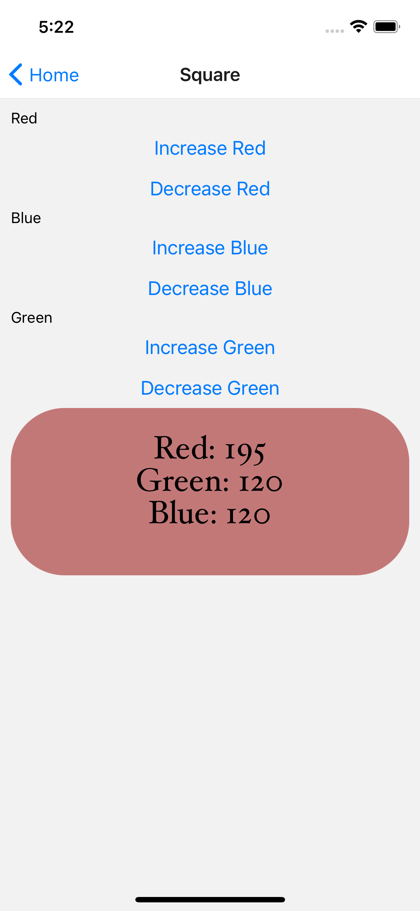

<!-- PROJECT LOGO -->
 

<h3 align="center">Christmin's Learning Journal</h3>

  

22 April 2022

<!-- ABOUT THE PROJECT -->

## Day Twelve

It is day 12 of learning React Native on Udemy. Today's learning topic is RN state managment - importance of handling error bounds and usability of switch case to optimize function. I want to go to the Ramadan bazaar to eat later lol.

## Action Items

1. Add bounds check to ensure the color values are between 0 to 255

2. Refactor the codes by creating a setColor function and pass in the color and value to update the states of the colors

3. Ensure that once value is 255/0, there will be no changes even when buttons are pressed.

## Learning Points

- Use switch case & ternary operator for readability of the code, using multiple if statements will make the code messy and harder to read.

- We use Enums to define a set of named constants. Using them makes it easier to document intent or create a set of distinct cases.

- Enums provides flexibility making it easier to express and document intentions and use cases.

- Enums allow for the creation of memory-efficient custom constants in JavaScript.

- Use const Colorful = [Color.RED, Color.BLUE, Color.GREEN]; instead of function() for cleaner code. (Thanks to our mentor Janan for the advice!)

- Can also use Object.values(Color) to extract data from enum directly (Thanks Jan for the advice!)

 

## Resources

- <a href="https://docs.google.com/document/d/1oK5syZNKl84an6b5rg3EHRSIEajXKJzBefa9rV4nxe0">Day 13: React Native State Management</a>
- <a href="https://docs.google.com/document/d/1X1WgRPKxWwenKXswD5xHcuEZ4NFRj8EWmkCC8MLsBwg/">React Native Learning Schedule</a>

<!-- ACKNOWLEDGMENTS -->

## Acknowledgments

- Thank you to the Team at Activate Interactive
- <a href="https://github.com/othneildrew/Best-README-Template">Othneil Drew</a> for this Template

(<a href="#top">back to top</a>)

