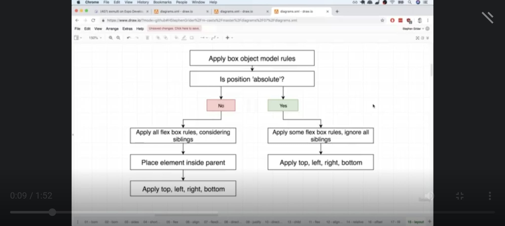
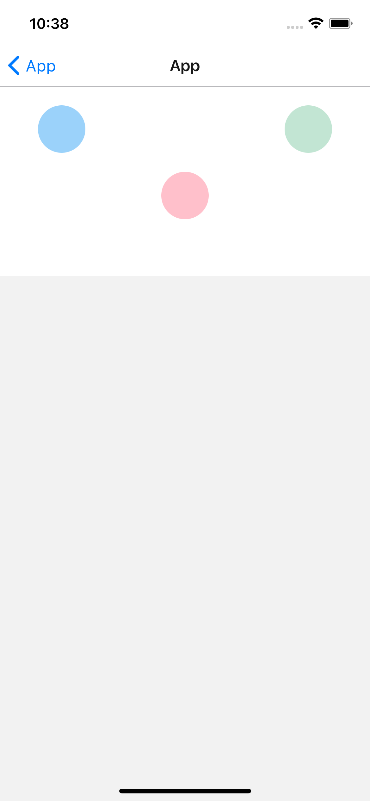

<!-- PROJECT LOGO -->
 

<h3 align="center">Christmin's Learning Journal</h3>

  

28 April 2022

<!-- ABOUT THE PROJECT -->

## Day Fifteen

It is day 15 of learning React Native on Udemy. Today's learning topic is React Native Design System.

## Action Items

1. Try the exercise to flex the css side of your brain

## Learning Points

- Types of Layout System

> Box Object Model: The height/width of an element & the space around it - use to affect the positioning of a single element
> Flex Box: How some number of siblings element get laid out inside a parent - use this to position multiple elements with a common parent
> Position: How a single element get laid out inside an element - use to override Box Object Model & FlexBox

- The default settings for alignItems is stretch. Every child is going to stretch to fill up as much space as possible and can be affected by flexDirection.

flex-start: Align children of a container to the start of the container's cross axis.

- flex-end: Align children of a container to the end of the container's cross axis.

- center: Align children of a container in the center of the container's cross axis.

- baseline:Align children of a container along a common baseline. Individual children can be set to be the reference baseline for their parents.

- flexDirection - controls if children are going to be display horizontally or vertically. Default flexDirection is column (children display vertically)

- flexDirection column: display items line by line (vertically)

- flexDirection row: display items side by side (horizontally)

- alignItems will be affected by flexDirection as it will stretch horizontally (if flexDirection is column/default) or stretch vertically (if flexDirection is row)

- justifyContent works in the opposite direction of alignItems. It can also can be affected by flexDirection

  > flex-start, flex-end, space-between (distribute evenly), space-around
  > (same as space between but with spacing from top and bottom of screen as well)

- Properties to apply to child components include flex and alignSelf

  > 0 flex value = inflexible flex component, size following width and height
  > Positive flex value = flexible flex component sized porpotionately to flex value. (flex 1 = 10%, flex 4 = 40%)

- alignSelf is for making child components have different positions on the screen. (Override parent element values)

- Position: default value is relative. We can change it to absolute (it will be ignored by other child elements). Absolute child components might still follow some parent flexbox properties. The position is determined b

- If you want a child element to fill up the parent entirely :

instead of:

const styles = StyleSheet.create({
backgroundImage: {
position: 'absolute',
top: 0,
right: 0,
bottom: 0,
left: 0,
},
})

Replace it with:

const styles = StyleSheet.create({
backgroundImage: {
...StyleSheet.absoluteFillObject,
},
})

## Box Object Model Rules

 

 

## Udemy Exercise

## Resources

- <a href="https://docs.google.com/document/d/1oqOjm59OuK4851gzJ2tOMHdC5G2OcKV067PUKadJjho/edit">Day 17: React Native Layout</a>
- <a href="https://docs.google.com/document/d/1X1WgRPKxWwenKXswD5xHcuEZ4NFRj8EWmkCC8MLsBwg/">React Native Learning Schedule</a>

## Acknowledgments

- Thank you to the Team at Activate Interactive
- <a href="https://github.com/othneildrew/Best-README-Template">Othneil Drew</a> for this Template

(<a href="#top">back to top</a>)

