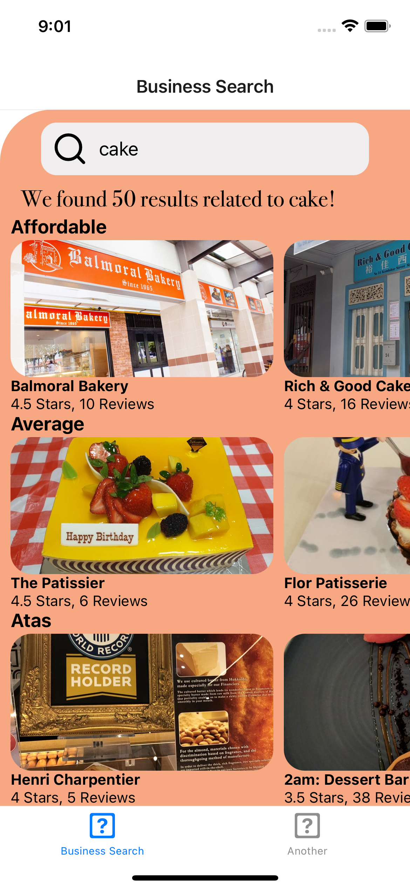

<!-- PROJECT LOGO -->
 

<h3 align="center">Christmin's Learning Journal</h3>

  

09 May 2022

<!-- ABOUT THE PROJECT -->

## React Native Training

Continuation of learning React Native on Udemy. Today's learning topic is React Native Custom Hooks.

## Learning Points

- What is Custom Hooks? A custom Hook is a JavaScript function whose name starts with ”use” and that may call other Hooks

- A custom hook is a essentially a reusable function.

- Advantages : Reusable on other components if the same logic is required & improve readabilty of componenet tree.

## Rules of Using React Hooks

- Hooks are just JavaScript functions, but they require two specific rules:

- Hooks should be performed at the very top of the function hierarchy which means that the users should not call hooks in conditions and loops, otherwise the reaction cannot guarantee the execution order of hooks.

- We should call hooks only in React functions or functional components or call hooks from custom hooks.

## Udemy Exercise

 

## Resources

- <a href="https://docs.google.com/document/d/1gi-b9OeYKEOQ1KTVcfV8wCKC9yZQJp9UUGYFchH3lRA/">Day 23: React Native Restaurant App - With useEffect Hook</a>
- <a href="https://docs.google.com/document/d/1X1WgRPKxWwenKXswD5xHcuEZ4NFRj8EWmkCC8MLsBwg/">React Native Learning Schedule</a>

## Acknowledgments

- Thank you to the Team at Activate Interactive
- <a href="https://github.com/othneildrew/Best-README-Template">Othneil Drew</a> for this Template

(<a href="#top">back to top</a>)

